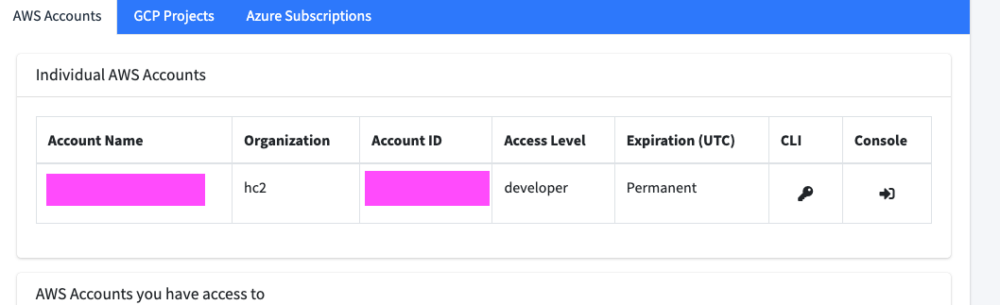
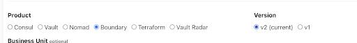
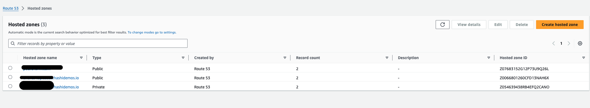

# terraform-aws-prereqs

Terraform module to create base prerequisite resources in preparation to deploy Hashicorp products in Amazon Web Services (AWS).

Relative to the Hashicorp Services modules hosted in the https://github.com/hashicorp-services org under the name
`terraform-<provider>-<product>-enterprise-hvd`.

## Prerequisites
Before deploying this module, you need to make sure the following steps have been covered:

### 1. How to generate a project
+ You can find the link to do it here:https://doormat.hashicorp.services/
  
  

Please Notice you can grab your AWS Project Id here. 

+ This repository includes a link to pre-configured TLS module for your convenience. However, if you prefer using a different cloud provider, you have options:
    #Available TLS Certificate Modules


| Cloud Provider  | Link |
|----------------|------|
| Google Cloud Platform (GCP) | https://github.com/hashicorp-services/terraform-acme-tls-google |
| Amazon Web Services (AWS) | https://github.com/hashicorp-services/terraform-acme-tls-aws|
| Microsoft Azure | https://github.com/hashicorp-services/terraform-acme-tls-azurerm |


If you have experience with a specific cloud provider and would like to use their native TLS solutions, you're welcome to do so. Just ensure that your chosen method integrates well with the rest of your infrastructure.

### 2. How to Generate the license
+ An Enterprise license for your product, example: Boundary Enterprise license
  + Request one from our internal page: https://license.hashicorp.services/customers

+ Please be aware that every product has its own license requirements, so please follow the official documentation to asked for a license for each product here:
https://hashicorp.atlassian.net/wiki/spaces/SE/pages/75104418/Generate+Boundary+Terraform+Vault+Consul+and+Nomad+Licenses
Terraform Enterprise:
Vault Enterprise:
Boundary Enterprise: https://hashicorp.atlassian.net/wiki/spaces/SE/pages/75104418/Generate+Boundary+Terraform+Vault+Consul+and+Nomad+Licenses#Boundary

- HashiCorp License
  - This can be created by using <https://license.hashicorp.services/> to create a license for the product you are deploying. After creating a new customer for yourself, create a new license, select the product, and always select v2 for the version. Flags may be required to enable the features needed for the product.

    

Once you get the license you will need to save it in a secure location in your workstation. We are going to need this license in the first module we will use. 

### 3. How to Install AWS Command Line Interface (AWS CLI) 

If you haven't already installed the AWS CLI on your local system, follow these steps:

+ For Windows: Download and run the installer
+ For macOS: Use Homebrew or download the interactive installer
+ For Linux: Use your distribution's package manager or download the archive

Here's how to install AWS CLI on macOS using Homebrew.
Install Homebrew (if you haven't already):

```
/bin/bash -c "$(curl -fsSL https://raw.githubusercontent.com/Homebrew/install/HEAD/install.sh)"
```

```
brew update
```

Install the AWS CLI using Homebrew:

```
brew install awscli
```

After installation, open a new terminal window and verify the installation by running:

```
aws --version
```

To start using the AWS CLI, you'll need to configure it to work with doormat:
```
doormat login 
```

To configure the account use 
```
doormat aws export --account <Project ID>
```

## 4. Generate the TLS certificate using the AWS TLS terraform module.

+ Be sure you have already a working AWS project set up
+ You can find our AWS TLS Terraform module on this link (https://github.com/hashicorp-services/terraform-acme-tls-aws)
  
### Module structure terraform-acme-tls-aws

```
terraform-acme-tls-aws/
├── README.md
├── examples/
│   └── default/
│       ├── README.md
│       ├── main.tf
│       ├── outputs.tf
│       ├── terraform.tfvars.example
│       └── variables.tf
├── main.tf
├── outputs.tf
├── tests/
├── variables.tf
└── versions.tf
```
Steps to Generate TLS Certificate

### 4.1 Configure AWS to work with Doormat:

Remember to login into doormat if you have not do it:

```bash
doormat login 
```

Configure doormat with your project ID from AWS 
```shell
doormat aws export --account <Project ID>
```


### 4.2 Navigate to the default example directory:

```bash
cd terraform-acme-tls-aws/examples/default
```

### 4.3 Create your configuration file:
In this step we are making a copy of the tfvars to work on it, remembere this is inside examples/default inside the terraform-acme-tls-aws directory

```bash
cp terraform.tfvars.example terraform.tfvars
```

### 4.4 Edit terraform.tfvars and update the following variables:

```bash
route53_public_zone_name = "<username.sbx.hashidemos.io>"
tls_cert_fqdn            = "<tfe.username.sbx.hashidemos.io>"
tls_cert_email_address   = "<username@hashicorp.com>"
create_cert_files        = <true>
add_cert_filename_prefix = <true>
```

You can find the values for the route53 public zone name here:



Your tfvars file should look similar to this:


### 4.5 Save the file and proceed with your Terraform operations to generate the TLS certificate.

Initialize Terraform and apply the configuration:
Remember that this should be executed inside the examples/default path
   ```
   terraform init
   terraform plan
   terraform apply
   ```

## 5. How to use the prerequisites modules:
Notice please that before proceeding with this section, ensure you have completed Parts 1, 2, and 3. 

 You should receive outputs similar to this one if you are using AWS TLS module:

   ```
   Outputs:
   tls_ca_bundle_base64 = "string"
   tls_cert_base64 = "string"
   tls_fullchain_base64 = "string"
   tls_privkey_base64 = <sensitive>
   ```

To view the content of `tls_privkey_base64`, run:
   ```
   terraform output tls_privkey_base64
   ```


Now please be awared you are going to use the outputs from the TLS module as the tfvars in the next module

### Module Structure

The module is structured as follows:

```
terraform-aws-prereqs/
├── LICENSE
├── README copy.md
├── README.md
├── bastion.tf
├── cloudwatch_log_group.tf
├── data.tf
├── examples/
│   ├── boundary/
│   ├── tfe-container/
│   └── tfe-eks/
├── key_pair.tf
├── kms.tf
├── outputs.tf
├── secrets_manager.tf
├── templates/
├── tests/
├── variables.tf
├── versions.tf
├── vpc.tf
└── docs/
```

Now open a new terminal, in this terminal you should do the following:

### 5.1 Please be sure to first go to your doormat page and get the AWS project id:

Remember to login into doormat if you have not do it:

```bash
doormat login 
```

Configure doormat with your project ID from AWS

```shell
doormat aws export --account <Project ID>
```

you should now cd into examples directory

```bash
cd terraform-aws-prereqs/examples
```

The examples directory contains three deployment options:

  1) tfe-container

  2) boundary

  3) tfe-eks

Choose the appropriate subdirectory based on your desired deployment target. Navigate to the selected directory to begin your deployment process.

Steps to Generate Pre-requesites:


### 5.2 Choose the appropriate subdirectory based on your desired deployment target.
Navigate to the selected directory. For example, for tfe-eks deployment:

```bash
cd tfe-eks
```

List the contents of the directory:
```bash
ls
```

You should see files similar to:

```bash
README.md                       outputs.tf                      terraform.tfvars.example
main.tf                         variables.tf
```

### 5.3 Prepare your Terraform variables file:

Locate the terraform.tfvars.example file
Create a copy of this file named terraform.tfvars:

```bash
cp terraform.tfvars.example terraform.tfvars
```

### 5.4 Before deploying, you need to set up your terraform.tfvars file with the following variables:

Remember that you should use the outputs of the terraform tls execution you did before
Please remember to change project_id and set the region to the one you want to deploy it

Edit `terraform.tfvars` with your specific configuration values:

```bash
# --- Common --- #
friendly_name_prefix = "<example>"
common_tags = {
  App         = "<tfe-prereqs>"
  Environment = "<test>"
  Owner       = "<YourName>"
}

# --- Networking --- #
create_vpc                     = <true>
vpc_cidr                       = "<10.0.0.0/16>"
lb_is_internal                 = <true>
public_subnet_cidrs            = ["10.0.1.0/24", "10.0.2.0/24", "10.0.3.0/24"]
private_subnet_cidrs           = ["10.0.253.0/24", "10.0.254.0/24", "10.0.255.0/24"]
create_bastion                 = <true>
bastion_ec2_keypair_name       = "<existing_bastion_keypair_name>"
bastion_cidr_allow_ingress_ssh = ["<192.168.1.0/24>"]

# --- Secrets Manager Prereq Secrets --- #
tfe_license_secret_value              = "<iamafaketfelicensekey>"
tfe_encryption_password_secret_value  = "<iamafaketfeencryptionpassword>"
tfe_database_password_secret_value    = "<iamafaketfedatabasepassword>"
tfe_redis_password_secret_value       = "<iamafaketferedispassword>"

# --- Cloudwatch Log Group --- #
create_cloudwatch_log_group = <true>
cloudwatch_log_group_name   = "<tfe-log-fwd>"

# --- KMS --- #
create_kms_cmk              = <true>
kms_cmk_alias               = "<tfe>"
kms_allow_asg_to_cmk        = <true>
kms_cmk_deletion_window     = <7>
kms_cmk_enable_key_rotation = <true>


```

Note that the *lb_is_internal* variables in the example prerequisite folders do not have effect on the actual resources being created, since the load balancer is supposed to be created by the HVD modules. The intent of these variables is to generate the right subnet outputs, with either public or private networks. These subnet outputs are meant to be copied over to the HVD module tfvars file, so the *lb_is_internal* here must match the desired setting in the HVD module. An output with the same name is also provided in the example folders, so it can be copied over as well.

### 5.5 Initialize Terraform and apply the configuration:
   ```
   terraform init
   terraform plan
   terraform apply
   ```

## KMS & Auto Scaling

If using this module with `create_kms_cmk` as `true` and an AWS account that has never created an Auto Scaling Group before, this will fail as the built in AWS Auto Scaling role will not exist yet. Create an ASG manually first and delete it in the account for the built in AWS role to exist.  

---
<!-- BEGIN_TF_DOCS -->
## Requirements

| Name | Version |
|------|---------|
| <a name="requirement_terraform"></a> [terraform](#requirement\_terraform) | >= 1.8 |
| <a name="requirement_aws"></a> [aws](#requirement\_aws) | >= 5.54.0 |
| <a name="requirement_random"></a> [random](#requirement\_random) | >=3.4.3 |

## Providers

| Name | Version |
|------|---------|
| <a name="provider_aws"></a> [aws](#provider\_aws) | >= 5.54.0 |
| <a name="provider_random"></a> [random](#provider\_random) | >=3.4.3 |

## Resources

| Name | Type |
|------|------|
| [aws_cloudwatch_log_group.this](https://registry.terraform.io/providers/hashicorp/aws/latest/docs/resources/cloudwatch_log_group) | resource |
| [aws_eip.nat_eip](https://registry.terraform.io/providers/hashicorp/aws/latest/docs/resources/eip) | resource |
| [aws_instance.bastion](https://registry.terraform.io/providers/hashicorp/aws/latest/docs/resources/instance) | resource |
| [aws_internet_gateway.igw](https://registry.terraform.io/providers/hashicorp/aws/latest/docs/resources/internet_gateway) | resource |
| [aws_key_pair.this](https://registry.terraform.io/providers/hashicorp/aws/latest/docs/resources/key_pair) | resource |
| [aws_kms_alias.this](https://registry.terraform.io/providers/hashicorp/aws/latest/docs/resources/kms_alias) | resource |
| [aws_kms_key.this](https://registry.terraform.io/providers/hashicorp/aws/latest/docs/resources/kms_key) | resource |
| [aws_nat_gateway.ngw](https://registry.terraform.io/providers/hashicorp/aws/latest/docs/resources/nat_gateway) | resource |
| [aws_route.route_private](https://registry.terraform.io/providers/hashicorp/aws/latest/docs/resources/route) | resource |
| [aws_route.route_public](https://registry.terraform.io/providers/hashicorp/aws/latest/docs/resources/route) | resource |
| [aws_route_table.rtb_private](https://registry.terraform.io/providers/hashicorp/aws/latest/docs/resources/route_table) | resource |
| [aws_route_table.rtb_public](https://registry.terraform.io/providers/hashicorp/aws/latest/docs/resources/route_table) | resource |
| [aws_route_table_association.rtbassoc-private](https://registry.terraform.io/providers/hashicorp/aws/latest/docs/resources/route_table_association) | resource |
| [aws_route_table_association.rtbassoc-public](https://registry.terraform.io/providers/hashicorp/aws/latest/docs/resources/route_table_association) | resource |
| [aws_s3_bucket.snapshot](https://registry.terraform.io/providers/hashicorp/aws/latest/docs/resources/s3_bucket) | resource |
| [aws_s3_bucket_public_access_block.tfe](https://registry.terraform.io/providers/hashicorp/aws/latest/docs/resources/s3_bucket_public_access_block) | resource |
| [aws_secretsmanager_secret.boundary_database_password](https://registry.terraform.io/providers/hashicorp/aws/latest/docs/resources/secretsmanager_secret) | resource |
| [aws_secretsmanager_secret.boundary_license](https://registry.terraform.io/providers/hashicorp/aws/latest/docs/resources/secretsmanager_secret) | resource |
| [aws_secretsmanager_secret.boundary_tls_ca_bundle](https://registry.terraform.io/providers/hashicorp/aws/latest/docs/resources/secretsmanager_secret) | resource |
| [aws_secretsmanager_secret.boundary_tls_cert](https://registry.terraform.io/providers/hashicorp/aws/latest/docs/resources/secretsmanager_secret) | resource |
| [aws_secretsmanager_secret.boundary_tls_privkey](https://registry.terraform.io/providers/hashicorp/aws/latest/docs/resources/secretsmanager_secret) | resource |
| [aws_secretsmanager_secret.consul_license](https://registry.terraform.io/providers/hashicorp/aws/latest/docs/resources/secretsmanager_secret) | resource |
| [aws_secretsmanager_secret.consul_tls_ca_bundle](https://registry.terraform.io/providers/hashicorp/aws/latest/docs/resources/secretsmanager_secret) | resource |
| [aws_secretsmanager_secret.consul_tls_cert](https://registry.terraform.io/providers/hashicorp/aws/latest/docs/resources/secretsmanager_secret) | resource |
| [aws_secretsmanager_secret.consul_tls_privkey](https://registry.terraform.io/providers/hashicorp/aws/latest/docs/resources/secretsmanager_secret) | resource |
| [aws_secretsmanager_secret.nomad_gossip_encryption_key](https://registry.terraform.io/providers/hashicorp/aws/latest/docs/resources/secretsmanager_secret) | resource |
| [aws_secretsmanager_secret.nomad_license](https://registry.terraform.io/providers/hashicorp/aws/latest/docs/resources/secretsmanager_secret) | resource |
| [aws_secretsmanager_secret.nomad_tls_ca_bundle](https://registry.terraform.io/providers/hashicorp/aws/latest/docs/resources/secretsmanager_secret) | resource |
| [aws_secretsmanager_secret.nomad_tls_cert](https://registry.terraform.io/providers/hashicorp/aws/latest/docs/resources/secretsmanager_secret) | resource |
| [aws_secretsmanager_secret.nomad_tls_privkey](https://registry.terraform.io/providers/hashicorp/aws/latest/docs/resources/secretsmanager_secret) | resource |
| [aws_secretsmanager_secret.tfe_database_password](https://registry.terraform.io/providers/hashicorp/aws/latest/docs/resources/secretsmanager_secret) | resource |
| [aws_secretsmanager_secret.tfe_encryption_password](https://registry.terraform.io/providers/hashicorp/aws/latest/docs/resources/secretsmanager_secret) | resource |
| [aws_secretsmanager_secret.tfe_license](https://registry.terraform.io/providers/hashicorp/aws/latest/docs/resources/secretsmanager_secret) | resource |
| [aws_secretsmanager_secret.tfe_redis_password](https://registry.terraform.io/providers/hashicorp/aws/latest/docs/resources/secretsmanager_secret) | resource |
| [aws_secretsmanager_secret.tfe_tls_ca_bundle](https://registry.terraform.io/providers/hashicorp/aws/latest/docs/resources/secretsmanager_secret) | resource |
| [aws_secretsmanager_secret.tfe_tls_cert](https://registry.terraform.io/providers/hashicorp/aws/latest/docs/resources/secretsmanager_secret) | resource |
| [aws_secretsmanager_secret.tfe_tls_privkey](https://registry.terraform.io/providers/hashicorp/aws/latest/docs/resources/secretsmanager_secret) | resource |
| [aws_secretsmanager_secret.vault_license](https://registry.terraform.io/providers/hashicorp/aws/latest/docs/resources/secretsmanager_secret) | resource |
| [aws_secretsmanager_secret.vault_tls_ca_bundle](https://registry.terraform.io/providers/hashicorp/aws/latest/docs/resources/secretsmanager_secret) | resource |
| [aws_secretsmanager_secret.vault_tls_cert](https://registry.terraform.io/providers/hashicorp/aws/latest/docs/resources/secretsmanager_secret) | resource |
| [aws_secretsmanager_secret.vault_tls_privkey](https://registry.terraform.io/providers/hashicorp/aws/latest/docs/resources/secretsmanager_secret) | resource |
| [aws_secretsmanager_secret_version.boundary_database_password](https://registry.terraform.io/providers/hashicorp/aws/latest/docs/resources/secretsmanager_secret_version) | resource |
| [aws_secretsmanager_secret_version.boundary_license](https://registry.terraform.io/providers/hashicorp/aws/latest/docs/resources/secretsmanager_secret_version) | resource |
| [aws_secretsmanager_secret_version.boundary_tls_ca_bundle](https://registry.terraform.io/providers/hashicorp/aws/latest/docs/resources/secretsmanager_secret_version) | resource |
| [aws_secretsmanager_secret_version.boundary_tls_cert](https://registry.terraform.io/providers/hashicorp/aws/latest/docs/resources/secretsmanager_secret_version) | resource |
| [aws_secretsmanager_secret_version.boundary_tls_privkey](https://registry.terraform.io/providers/hashicorp/aws/latest/docs/resources/secretsmanager_secret_version) | resource |
| [aws_secretsmanager_secret_version.consul_license](https://registry.terraform.io/providers/hashicorp/aws/latest/docs/resources/secretsmanager_secret_version) | resource |
| [aws_secretsmanager_secret_version.consul_tls_ca_bundle](https://registry.terraform.io/providers/hashicorp/aws/latest/docs/resources/secretsmanager_secret_version) | resource |
| [aws_secretsmanager_secret_version.consul_tls_cert](https://registry.terraform.io/providers/hashicorp/aws/latest/docs/resources/secretsmanager_secret_version) | resource |
| [aws_secretsmanager_secret_version.consul_tls_privkey](https://registry.terraform.io/providers/hashicorp/aws/latest/docs/resources/secretsmanager_secret_version) | resource |
| [aws_secretsmanager_secret_version.nomad_gossip_encryption_key](https://registry.terraform.io/providers/hashicorp/aws/latest/docs/resources/secretsmanager_secret_version) | resource |
| [aws_secretsmanager_secret_version.nomad_license](https://registry.terraform.io/providers/hashicorp/aws/latest/docs/resources/secretsmanager_secret_version) | resource |
| [aws_secretsmanager_secret_version.nomad_tls_ca_bundle](https://registry.terraform.io/providers/hashicorp/aws/latest/docs/resources/secretsmanager_secret_version) | resource |
| [aws_secretsmanager_secret_version.nomad_tls_cert](https://registry.terraform.io/providers/hashicorp/aws/latest/docs/resources/secretsmanager_secret_version) | resource |
| [aws_secretsmanager_secret_version.nomad_tls_privkey](https://registry.terraform.io/providers/hashicorp/aws/latest/docs/resources/secretsmanager_secret_version) | resource |
| [aws_secretsmanager_secret_version.tfe_database_password](https://registry.terraform.io/providers/hashicorp/aws/latest/docs/resources/secretsmanager_secret_version) | resource |
| [aws_secretsmanager_secret_version.tfe_encryption_password](https://registry.terraform.io/providers/hashicorp/aws/latest/docs/resources/secretsmanager_secret_version) | resource |
| [aws_secretsmanager_secret_version.tfe_license](https://registry.terraform.io/providers/hashicorp/aws/latest/docs/resources/secretsmanager_secret_version) | resource |
| [aws_secretsmanager_secret_version.tfe_redis_password](https://registry.terraform.io/providers/hashicorp/aws/latest/docs/resources/secretsmanager_secret_version) | resource |
| [aws_secretsmanager_secret_version.tfe_tls_ca_bundle](https://registry.terraform.io/providers/hashicorp/aws/latest/docs/resources/secretsmanager_secret_version) | resource |
| [aws_secretsmanager_secret_version.tfe_tls_cert](https://registry.terraform.io/providers/hashicorp/aws/latest/docs/resources/secretsmanager_secret_version) | resource |
| [aws_secretsmanager_secret_version.tfe_tls_privkey](https://registry.terraform.io/providers/hashicorp/aws/latest/docs/resources/secretsmanager_secret_version) | resource |
| [aws_secretsmanager_secret_version.vault_license](https://registry.terraform.io/providers/hashicorp/aws/latest/docs/resources/secretsmanager_secret_version) | resource |
| [aws_secretsmanager_secret_version.vault_tls_ca_bundle](https://registry.terraform.io/providers/hashicorp/aws/latest/docs/resources/secretsmanager_secret_version) | resource |
| [aws_secretsmanager_secret_version.vault_tls_cert](https://registry.terraform.io/providers/hashicorp/aws/latest/docs/resources/secretsmanager_secret_version) | resource |
| [aws_secretsmanager_secret_version.vault_tls_privkey](https://registry.terraform.io/providers/hashicorp/aws/latest/docs/resources/secretsmanager_secret_version) | resource |
| [aws_security_group.bastion](https://registry.terraform.io/providers/hashicorp/aws/latest/docs/resources/security_group) | resource |
| [aws_security_group_rule.bastion_allow_egress_all](https://registry.terraform.io/providers/hashicorp/aws/latest/docs/resources/security_group_rule) | resource |
| [aws_security_group_rule.bastion_allow_ingress_ssh](https://registry.terraform.io/providers/hashicorp/aws/latest/docs/resources/security_group_rule) | resource |
| [aws_subnet.private](https://registry.terraform.io/providers/hashicorp/aws/latest/docs/resources/subnet) | resource |
| [aws_subnet.public](https://registry.terraform.io/providers/hashicorp/aws/latest/docs/resources/subnet) | resource |
| [aws_vpc.main](https://registry.terraform.io/providers/hashicorp/aws/latest/docs/resources/vpc) | resource |
| [aws_vpc_endpoint.s3_endpoint](https://registry.terraform.io/providers/hashicorp/aws/latest/docs/resources/vpc_endpoint) | resource |
| [aws_vpc_endpoint_route_table_association.rtbassoc_s3_private](https://registry.terraform.io/providers/hashicorp/aws/latest/docs/resources/vpc_endpoint_route_table_association) | resource |
| [aws_vpc_endpoint_route_table_association.rtbassoc_s3_public](https://registry.terraform.io/providers/hashicorp/aws/latest/docs/resources/vpc_endpoint_route_table_association) | resource |
| [random_id.secret_suffix](https://registry.terraform.io/providers/hashicorp/random/latest/docs/resources/id) | resource |
| [aws_ami.bastion](https://registry.terraform.io/providers/hashicorp/aws/latest/docs/data-sources/ami) | data source |
| [aws_availability_zones.available](https://registry.terraform.io/providers/hashicorp/aws/latest/docs/data-sources/availability_zones) | data source |
| [aws_caller_identity.current](https://registry.terraform.io/providers/hashicorp/aws/latest/docs/data-sources/caller_identity) | data source |
| [aws_iam_policy_document.kms_cmk](https://registry.terraform.io/providers/hashicorp/aws/latest/docs/data-sources/iam_policy_document) | data source |
| [aws_region.current](https://registry.terraform.io/providers/hashicorp/aws/latest/docs/data-sources/region) | data source |
| [aws_vpc_endpoint_service.s3_endpoint](https://registry.terraform.io/providers/hashicorp/aws/latest/docs/data-sources/vpc_endpoint_service) | data source |

## Inputs

| Name | Description | Type | Default | Required |
|------|-------------|------|---------|:--------:|
| <a name="input_friendly_name_prefix"></a> [friendly\_name\_prefix](#input\_friendly\_name\_prefix) | Friendly name prefix used for tagging and naming AWS resources. | `string` | n/a | yes |
| <a name="input_bastion_cidr_allow_ingress_ssh"></a> [bastion\_cidr\_allow\_ingress\_ssh](#input\_bastion\_cidr\_allow\_ingress\_ssh) | List of source CIDR ranges to allow inbound to bastion on port 22 (SSH). | `list(string)` | `[]` | no |
| <a name="input_bastion_ec2_keypair_name"></a> [bastion\_ec2\_keypair\_name](#input\_bastion\_ec2\_keypair\_name) | Existing SSH key pair to use for bastion EC2 instance. | `string` | `null` | no |
| <a name="input_boundary_database_password_secret_name"></a> [boundary\_database\_password\_secret\_name](#input\_boundary\_database\_password\_secret\_name) | Name of AWS Secrets Manager secret for Boundary database password. | `string` | `"boundary-database-password"` | no |
| <a name="input_boundary_database_password_secret_value"></a> [boundary\_database\_password\_secret\_value](#input\_boundary\_database\_password\_secret\_value) | Value of Boundary Database Password create as AWS Secrets Manager secret. | `string` | `null` | no |
| <a name="input_boundary_license_secret_name"></a> [boundary\_license\_secret\_name](#input\_boundary\_license\_secret\_name) | Name of AWS Secrets Manager secret for Boundary license. | `string` | `"boundary-license"` | no |
| <a name="input_boundary_license_secret_value"></a> [boundary\_license\_secret\_value](#input\_boundary\_license\_secret\_value) | Raw contents of the Boundary license file to create as AWS Secrets Manager secret. | `string` | `null` | no |
| <a name="input_boundary_tls_ca_bundle_secret_name"></a> [boundary\_tls\_ca\_bundle\_secret\_name](#input\_boundary\_tls\_ca\_bundle\_secret\_name) | Name of AWS Secrets Manager secret for Boundary TLS CA bundle. | `string` | `"boundary-tls-ca-bundle-base64"` | no |
| <a name="input_boundary_tls_ca_bundle_secret_value_base64"></a> [boundary\_tls\_ca\_bundle\_secret\_value\_base64](#input\_boundary\_tls\_ca\_bundle\_secret\_value\_base64) | Base64-encoded string value of Boundary TLS CA bundle in PEM format to create as AWS Secrets Manager secret. | `string` | `null` | no |
| <a name="input_boundary_tls_cert_secret_name"></a> [boundary\_tls\_cert\_secret\_name](#input\_boundary\_tls\_cert\_secret\_name) | Name of AWS Secrets Manager secret for Boundary TLS certificate. | `string` | `"boundary-tls-cert-base64"` | no |
| <a name="input_boundary_tls_cert_secret_value_base64"></a> [boundary\_tls\_cert\_secret\_value\_base64](#input\_boundary\_tls\_cert\_secret\_value\_base64) | Base64-encoded string value of Boundary TLS certificate in PEM format to create as AWS Secrets Manager secret. | `string` | `null` | no |
| <a name="input_boundary_tls_privkey_secret_name"></a> [boundary\_tls\_privkey\_secret\_name](#input\_boundary\_tls\_privkey\_secret\_name) | Name of AWS Secrets Manager secret for Boundary TLS private key. | `string` | `"boundary-tls-privkey-base64"` | no |
| <a name="input_boundary_tls_privkey_secret_value_base64"></a> [boundary\_tls\_privkey\_secret\_value\_base64](#input\_boundary\_tls\_privkey\_secret\_value\_base64) | Base64-encoded string value of Boundary TLS private key in PEM format to create as AWS Secrets Manager secret. | `string` | `null` | no |
| <a name="input_cloudwatch_log_group_name"></a> [cloudwatch\_log\_group\_name](#input\_cloudwatch\_log\_group\_name) | Name of CloudWatch Log Group for log forwarding destination. | `string` | `"log-group"` | no |
| <a name="input_common_tags"></a> [common\_tags](#input\_common\_tags) | Map of common tags for all taggable AWS resources. | `map(string)` | `{}` | no |
| <a name="input_consul_license_secret_name"></a> [consul\_license\_secret\_name](#input\_consul\_license\_secret\_name) | Name of AWS Secrets Manager secret for Consul license. | `string` | `"consul-license"` | no |
| <a name="input_consul_license_secret_value"></a> [consul\_license\_secret\_value](#input\_consul\_license\_secret\_value) | Raw contents of the Consul license file to create as AWS Secrets Manager secret. | `string` | `null` | no |
| <a name="input_consul_tls_ca_bundle_secret_name"></a> [consul\_tls\_ca\_bundle\_secret\_name](#input\_consul\_tls\_ca\_bundle\_secret\_name) | Name of AWS Secrets Manager secret for Consul TLS CA bundle. | `string` | `"consul-tls-ca-bundle-base64"` | no |
| <a name="input_consul_tls_ca_bundle_secret_value_base64"></a> [consul\_tls\_ca\_bundle\_secret\_value\_base64](#input\_consul\_tls\_ca\_bundle\_secret\_value\_base64) | Base64-encoded string value of Consul TLS CA bundle in PEM format to create as AWS Secrets Manager secret. | `string` | `null` | no |
| <a name="input_consul_tls_cert_secret_name"></a> [consul\_tls\_cert\_secret\_name](#input\_consul\_tls\_cert\_secret\_name) | Name of AWS Secrets Manager secret for Consul TLS certificate. | `string` | `"consul-tls-cert-base64"` | no |
| <a name="input_consul_tls_cert_secret_value_base64"></a> [consul\_tls\_cert\_secret\_value\_base64](#input\_consul\_tls\_cert\_secret\_value\_base64) | Base64-encoded string value of Consul TLS certificate in PEM format to create as AWS Secrets Manager secret. | `string` | `null` | no |
| <a name="input_consul_tls_privkey_secret_name"></a> [consul\_tls\_privkey\_secret\_name](#input\_consul\_tls\_privkey\_secret\_name) | Name of AWS Secrets Manager secret for Consul TLS private key. | `string` | `"consul-tls-privkey-base64"` | no |
| <a name="input_consul_tls_privkey_secret_value_base64"></a> [consul\_tls\_privkey\_secret\_value\_base64](#input\_consul\_tls\_privkey\_secret\_value\_base64) | Base64-encoded string value of Consul TLS private key in PEM format to create as AWS Secrets Manager secret. | `string` | `null` | no |
| <a name="input_create_bastion"></a> [create\_bastion](#input\_create\_bastion) | Boolean to create a bastion EC2 instance. Only valid when `create_vpc` is `true`. | `bool` | `false` | no |
| <a name="input_create_cloudwatch_log_group"></a> [create\_cloudwatch\_log\_group](#input\_create\_cloudwatch\_log\_group) | Boolean to create a Cloud Watch Log Group to be used as a log forwarding destination. | `bool` | `false` | no |
| <a name="input_create_ec2_ssh_keypair"></a> [create\_ec2\_ssh\_keypair](#input\_create\_ec2\_ssh\_keypair) | Boolean to create EC2 SSH key pair. This is separate from the `bastion_keypair` input variable. | `bool` | `false` | no |
| <a name="input_create_kms_cmk"></a> [create\_kms\_cmk](#input\_create\_kms\_cmk) | Boolean to create AWS KMS customer managed key (CMK). | `bool` | `false` | no |
| <a name="input_create_snapshot_s3_bucket"></a> [create\_snapshot\_s3\_bucket](#input\_create\_snapshot\_s3\_bucket) | Boolean to S3 bucket for Consul snapshots. | `bool` | `false` | no |
| <a name="input_create_vpc"></a> [create\_vpc](#input\_create\_vpc) | Boolean to create a VPC. | `bool` | `false` | no |
| <a name="input_ec2_ssh_keypair_name"></a> [ec2\_ssh\_keypair\_name](#input\_ec2\_ssh\_keypair\_name) | Name of EC2 SSH key pair. | `string` | `"ec2-keypair"` | no |
| <a name="input_ec2_ssh_public_key"></a> [ec2\_ssh\_public\_key](#input\_ec2\_ssh\_public\_key) | Public key material for EC2 SSH Key Pair. | `string` | `null` | no |
| <a name="input_encrypt_cloudwatch_log_group"></a> [encrypt\_cloudwatch\_log\_group](#input\_encrypt\_cloudwatch\_log\_group) | Boolean to encrypt CloudWatch Log Group with KMS key. Only valid when `create_kms_cmk` is `true`. | `bool` | `false` | no |
| <a name="input_kms_allow_asg_to_cmk"></a> [kms\_allow\_asg\_to\_cmk](#input\_kms\_allow\_asg\_to\_cmk) | Boolen to create a KMS customer managed key (CMK) policy that grants the Service Linked Role 'AWSServiceRoleForAutoScaling' permissions to the CMK. | `bool` | `true` | no |
| <a name="input_kms_cmk_alias"></a> [kms\_cmk\_alias](#input\_kms\_cmk\_alias) | Alias for KMS customer managed key (CMK). | `string` | `null` | no |
| <a name="input_kms_cmk_deletion_window"></a> [kms\_cmk\_deletion\_window](#input\_kms\_cmk\_deletion\_window) | Duration in days to destroy the key after it is deleted. Must be between 7 and 30 days. | `number` | `7` | no |
| <a name="input_kms_cmk_enable_key_rotation"></a> [kms\_cmk\_enable\_key\_rotation](#input\_kms\_cmk\_enable\_key\_rotation) | Boolean to enable key rotation for the KMS customer managed key (CMK). | `bool` | `false` | no |
| <a name="input_log_group_retention_days"></a> [log\_group\_retention\_days](#input\_log\_group\_retention\_days) | Number of days to retain logs within CloudWatch Log Group. | `number` | `365` | no |
| <a name="input_nomad_gossip_encryption_key_secret_name"></a> [nomad\_gossip\_encryption\_key\_secret\_name](#input\_nomad\_gossip\_encryption\_key\_secret\_name) | Name of AWS Secrets Manager secret for Nomad gossip encryption key. | `string` | `"nomad-gossip"` | no |
| <a name="input_nomad_gossip_encryption_key_secret_value"></a> [nomad\_gossip\_encryption\_key\_secret\_value](#input\_nomad\_gossip\_encryption\_key\_secret\_value) | Value of Nomad Gossip Encryption key to create as AWS Secrets Manager secret | `string` | `null` | no |
| <a name="input_nomad_license_secret_name"></a> [nomad\_license\_secret\_name](#input\_nomad\_license\_secret\_name) | Name of AWS Secrets Manager secret for Nomad license. | `string` | `"nomad-license"` | no |
| <a name="input_nomad_license_secret_value"></a> [nomad\_license\_secret\_value](#input\_nomad\_license\_secret\_value) | Raw contents of the Nomad license file to create as AWS Secrets Manager secret. | `string` | `null` | no |
| <a name="input_nomad_tls_ca_bundle_secret_name"></a> [nomad\_tls\_ca\_bundle\_secret\_name](#input\_nomad\_tls\_ca\_bundle\_secret\_name) | Name of AWS Secrets Manager secret for Nomad TLS CA bundle. | `string` | `"nomad-tls-ca-bundle-base64"` | no |
| <a name="input_nomad_tls_ca_bundle_secret_value_base64"></a> [nomad\_tls\_ca\_bundle\_secret\_value\_base64](#input\_nomad\_tls\_ca\_bundle\_secret\_value\_base64) | Base64-encoded string value of Nomad TLS CA bundle in PEM format to create as AWS Secrets Manager secret. | `string` | `null` | no |
| <a name="input_nomad_tls_cert_secret_name"></a> [nomad\_tls\_cert\_secret\_name](#input\_nomad\_tls\_cert\_secret\_name) | Name of AWS Secrets Manager secret for Nomad TLS certificate. | `string` | `"nomad-tls-cert-base64"` | no |
| <a name="input_nomad_tls_cert_secret_value_base64"></a> [nomad\_tls\_cert\_secret\_value\_base64](#input\_nomad\_tls\_cert\_secret\_value\_base64) | Base64-encoded string value of Nomad TLS certificate in PEM format to create as AWS Secrets Manager secret. | `string` | `null` | no |
| <a name="input_nomad_tls_privkey_secret_name"></a> [nomad\_tls\_privkey\_secret\_name](#input\_nomad\_tls\_privkey\_secret\_name) | Name of AWS Secrets Manager secret for Nomad TLS private key. | `string` | `"nomad-tls-privkey-base64"` | no |
| <a name="input_nomad_tls_privkey_secret_value_base64"></a> [nomad\_tls\_privkey\_secret\_value\_base64](#input\_nomad\_tls\_privkey\_secret\_value\_base64) | Base64-encoded string value of Nomad TLS private key in PEM format to create as AWS Secrets Manager secret. | `string` | `null` | no |
| <a name="input_private_subnet_cidrs"></a> [private\_subnet\_cidrs](#input\_private\_subnet\_cidrs) | List of private subnet CIDR ranges to create in VPC. | `list(string)` | `[]` | no |
| <a name="input_public_subnet_cidrs"></a> [public\_subnet\_cidrs](#input\_public\_subnet\_cidrs) | List of public subnet CIDR ranges to create in VPC. | `list(string)` | `[]` | no |
| <a name="input_region"></a> [region](#input\_region) | AWS region to create resource in. | `string` | `null` | no |
| <a name="input_tfe_database_password_secret_name"></a> [tfe\_database\_password\_secret\_name](#input\_tfe\_database\_password\_secret\_name) | Name of AWS Secrets Manager secret for TFE database password. | `string` | `"tfe-database-password"` | no |
| <a name="input_tfe_database_password_secret_value"></a> [tfe\_database\_password\_secret\_value](#input\_tfe\_database\_password\_secret\_value) | Value of TFE Database Password create as AWS Secrets Manager secret. | `string` | `null` | no |
| <a name="input_tfe_encryption_password_secret_name"></a> [tfe\_encryption\_password\_secret\_name](#input\_tfe\_encryption\_password\_secret\_name) | Name of AWS Secrets Manager secret for TFE encryption password. | `string` | `"tfe-encryption-password"` | no |
| <a name="input_tfe_encryption_password_secret_value"></a> [tfe\_encryption\_password\_secret\_value](#input\_tfe\_encryption\_password\_secret\_value) | Value of TFE Encryption Password to create as AWS Secrets Manager secret. | `string` | `null` | no |
| <a name="input_tfe_license_secret_name"></a> [tfe\_license\_secret\_name](#input\_tfe\_license\_secret\_name) | Name of AWS Secrets Manager secret for TFE license. | `string` | `"tfe-license"` | no |
| <a name="input_tfe_license_secret_value"></a> [tfe\_license\_secret\_value](#input\_tfe\_license\_secret\_value) | Raw contents of the TFE license file to create as AWS Secrets Manager secret. | `string` | `null` | no |
| <a name="input_tfe_redis_password_secret_name"></a> [tfe\_redis\_password\_secret\_name](#input\_tfe\_redis\_password\_secret\_name) | Name of AWS Secrets Manager secret for TFE Redis password. | `string` | `"tfe-redis-password"` | no |
| <a name="input_tfe_redis_password_secret_value"></a> [tfe\_redis\_password\_secret\_value](#input\_tfe\_redis\_password\_secret\_value) | Value of TFE Redis Password create as AWS Secrets Manager secret. | `string` | `null` | no |
| <a name="input_tfe_tls_ca_bundle_secret_name"></a> [tfe\_tls\_ca\_bundle\_secret\_name](#input\_tfe\_tls\_ca\_bundle\_secret\_name) | Name of AWS Secrets Manager secret for TFE TLS CA bundle. | `string` | `"tfe-tls-ca-bundle-base64"` | no |
| <a name="input_tfe_tls_ca_bundle_secret_value_base64"></a> [tfe\_tls\_ca\_bundle\_secret\_value\_base64](#input\_tfe\_tls\_ca\_bundle\_secret\_value\_base64) | Base64-encoded string value of TFE TLS CA bundle in PEM format to create as AWS Secrets Manager secret. | `string` | `null` | no |
| <a name="input_tfe_tls_cert_secret_name"></a> [tfe\_tls\_cert\_secret\_name](#input\_tfe\_tls\_cert\_secret\_name) | Name of AWS Secrets Manager secret for TFE TLS certificate. | `string` | `"tfe-tls-cert-base64"` | no |
| <a name="input_tfe_tls_cert_secret_value_base64"></a> [tfe\_tls\_cert\_secret\_value\_base64](#input\_tfe\_tls\_cert\_secret\_value\_base64) | Base64-encoded string value of TFE TLS certificate in PEM format to create as AWS Secrets Manager secret. | `string` | `null` | no |
| <a name="input_tfe_tls_privkey_secret_name"></a> [tfe\_tls\_privkey\_secret\_name](#input\_tfe\_tls\_privkey\_secret\_name) | Name of AWS Secrets Manager secret for TFE TLS private key. | `string` | `"tfe-tls-privkey-base64"` | no |
| <a name="input_tfe_tls_privkey_secret_value_base64"></a> [tfe\_tls\_privkey\_secret\_value\_base64](#input\_tfe\_tls\_privkey\_secret\_value\_base64) | Base64-encoded string value of TFE TLS private key in PEM format to create as AWS Secrets Manager secret. | `string` | `null` | no |
| <a name="input_vault_encryption_password_secret_name"></a> [vault\_encryption\_password\_secret\_name](#input\_vault\_encryption\_password\_secret\_name) | Name of AWS Secrets Manager secret for VAULT encryption password. | `string` | `"vault-encryption-password"` | no |
| <a name="input_vault_encryption_password_secret_value"></a> [vault\_encryption\_password\_secret\_value](#input\_vault\_encryption\_password\_secret\_value) | Value of VAULT Encryption Password to create as AWS Secrets Manager secret. | `string` | `null` | no |
| <a name="input_vault_license_secret_name"></a> [vault\_license\_secret\_name](#input\_vault\_license\_secret\_name) | Name of AWS Secrets Manager secret for VAULT license. | `string` | `"vault-license"` | no |
| <a name="input_vault_license_secret_value"></a> [vault\_license\_secret\_value](#input\_vault\_license\_secret\_value) | Raw contents of the VAULT license file to create as AWS Secrets Manager secret. | `string` | `null` | no |
| <a name="input_vault_tls_ca_bundle_secret_name"></a> [vault\_tls\_ca\_bundle\_secret\_name](#input\_vault\_tls\_ca\_bundle\_secret\_name) | Name of AWS Secrets Manager secret for VAULT TLS CA bundle. | `string` | `"vault-tls-ca-bundle-base64"` | no |
| <a name="input_vault_tls_ca_bundle_secret_value_base64"></a> [vault\_tls\_ca\_bundle\_secret\_value\_base64](#input\_vault\_tls\_ca\_bundle\_secret\_value\_base64) | Base64-encoded string value of VAULT TLS CA bundle in PEM format to create as AWS Secrets Manager secret. | `string` | `null` | no |
| <a name="input_vault_tls_cert_secret_name"></a> [vault\_tls\_cert\_secret\_name](#input\_vault\_tls\_cert\_secret\_name) | Name of AWS Secrets Manager secret for VAULT TLS certificate. | `string` | `"vault-tls-cert-base64"` | no |
| <a name="input_vault_tls_cert_secret_value_base64"></a> [vault\_tls\_cert\_secret\_value\_base64](#input\_vault\_tls\_cert\_secret\_value\_base64) | Base64-encoded string value of VAULT TLS certificate in PEM format to create as AWS Secrets Manager secret. | `string` | `null` | no |
| <a name="input_vault_tls_privkey_secret_name"></a> [vault\_tls\_privkey\_secret\_name](#input\_vault\_tls\_privkey\_secret\_name) | Name of AWS Secrets Manager secret for VAULT TLS private key. | `string` | `"vault-tls-privkey-base64"` | no |
| <a name="input_vault_tls_privkey_secret_value_base64"></a> [vault\_tls\_privkey\_secret\_value\_base64](#input\_vault\_tls\_privkey\_secret\_value\_base64) | Base64-encoded string value of VAULT TLS private key in PEM format to create as AWS Secrets Manager secret. | `string` | `null` | no |
| <a name="input_vpc_cidr"></a> [vpc\_cidr](#input\_vpc\_cidr) | CIDR block for VPC. | `string` | `"10.1.0.0/16"` | no |
| <a name="input_vpc_name"></a> [vpc\_name](#input\_vpc\_name) | Name of VPC. | `string` | `"vpc"` | no |

## Outputs

| Name | Description |
|------|-------------|
| <a name="output_bastion_private_ip"></a> [bastion\_private\_ip](#output\_bastion\_private\_ip) | Private IP of bastion EC2 instance. |
| <a name="output_bastion_public_dns"></a> [bastion\_public\_dns](#output\_bastion\_public\_dns) | Public DNS name of bastion EC2 instance. |
| <a name="output_bastion_public_ip"></a> [bastion\_public\_ip](#output\_bastion\_public\_ip) | Public IP of bastion EC2 instance. |
| <a name="output_boundary_database_password_secret_arn"></a> [boundary\_database\_password\_secret\_arn](#output\_boundary\_database\_password\_secret\_arn) | ARN of Boundary database password AWS Secrets Manager secret. |
| <a name="output_boundary_license_secret_arn"></a> [boundary\_license\_secret\_arn](#output\_boundary\_license\_secret\_arn) | ARN of Boundary license AWS Secrets Manager secret. |
| <a name="output_boundary_tls_ca_bundle_secret_arn"></a> [boundary\_tls\_ca\_bundle\_secret\_arn](#output\_boundary\_tls\_ca\_bundle\_secret\_arn) | ARN of Boundary TLS CA bundle AWS Secrets Manager secret. |
| <a name="output_boundary_tls_cert_secret_arn"></a> [boundary\_tls\_cert\_secret\_arn](#output\_boundary\_tls\_cert\_secret\_arn) | ARN of Boundary TLS certificate AWS Secrets Manager secret. |
| <a name="output_boundary_tls_privkey_secret_arn"></a> [boundary\_tls\_privkey\_secret\_arn](#output\_boundary\_tls\_privkey\_secret\_arn) | ARN of Boundary TLS private key AWS Secrets Manager secret. |
| <a name="output_cloudwatch_log_group_name"></a> [cloudwatch\_log\_group\_name](#output\_cloudwatch\_log\_group\_name) | Name of AWS CloudWatch Log Group. |
| <a name="output_consul_agent_cert_arn"></a> [consul\_agent\_cert\_arn](#output\_consul\_agent\_cert\_arn) | n/a |
| <a name="output_consul_agent_key_arn"></a> [consul\_agent\_key\_arn](#output\_consul\_agent\_key\_arn) | n/a |
| <a name="output_consul_ca_cert_arn"></a> [consul\_ca\_cert\_arn](#output\_consul\_ca\_cert\_arn) | n/a |
| <a name="output_consul_license_text_arn"></a> [consul\_license\_text\_arn](#output\_consul\_license\_text\_arn) | n/a |
| <a name="output_kms_cmk_arn"></a> [kms\_cmk\_arn](#output\_kms\_cmk\_arn) | ARN of KMS customer managed key (CMK). |
| <a name="output_kms_cmk_id"></a> [kms\_cmk\_id](#output\_kms\_cmk\_id) | ID of KMS customer managed key (CMK). |
| <a name="output_nomad_gossip_encryption_key_secret_arn"></a> [nomad\_gossip\_encryption\_key\_secret\_arn](#output\_nomad\_gossip\_encryption\_key\_secret\_arn) | ARN of Nomad gossip encryption key AWS Secrets Manager secret. |
| <a name="output_nomad_license_secret_arn"></a> [nomad\_license\_secret\_arn](#output\_nomad\_license\_secret\_arn) | ARN of Nomad license AWS Secrets Manager secret. |
| <a name="output_nomad_tls_ca_bundle_secret_arn"></a> [nomad\_tls\_ca\_bundle\_secret\_arn](#output\_nomad\_tls\_ca\_bundle\_secret\_arn) | ARN of Nomad TLS CA bundle AWS Secrets Manager secret. |
| <a name="output_nomad_tls_cert_secret_arn"></a> [nomad\_tls\_cert\_secret\_arn](#output\_nomad\_tls\_cert\_secret\_arn) | ARN of Nomad TLS certificate AWS Secrets Manager secret. |
| <a name="output_nomad_tls_privkey_secret_arn"></a> [nomad\_tls\_privkey\_secret\_arn](#output\_nomad\_tls\_privkey\_secret\_arn) | ARN of Nomad TLS private key AWS Secrets Manager secret. |
| <a name="output_private_subnet_ids"></a> [private\_subnet\_ids](#output\_private\_subnet\_ids) | Subnet IDs of private subnets. |
| <a name="output_public_subnet_ids"></a> [public\_subnet\_ids](#output\_public\_subnet\_ids) | Subnet IDs of public subnets. |
| <a name="output_snapshot_s3_bucket_id"></a> [snapshot\_s3\_bucket\_id](#output\_snapshot\_s3\_bucket\_id) | n/a |
| <a name="output_ssh_keypair_fingerprint"></a> [ssh\_keypair\_fingerprint](#output\_ssh\_keypair\_fingerprint) | Fingerprint of SSH Key Pair. |
| <a name="output_ssh_keypair_id"></a> [ssh\_keypair\_id](#output\_ssh\_keypair\_id) | ID of TFE SSH Key Pair. |
| <a name="output_ssh_keypair_name"></a> [ssh\_keypair\_name](#output\_ssh\_keypair\_name) | Name of SSH Key Pair. |
| <a name="output_tfe_database_password_secret_arn"></a> [tfe\_database\_password\_secret\_arn](#output\_tfe\_database\_password\_secret\_arn) | ARN of TFE database password AWS Secrets Manager secret. |
| <a name="output_tfe_encryption_password_secret_arn"></a> [tfe\_encryption\_password\_secret\_arn](#output\_tfe\_encryption\_password\_secret\_arn) | ARN of TFE encryption password AWS Secrets Manager secret. |
| <a name="output_tfe_license_secret_arn"></a> [tfe\_license\_secret\_arn](#output\_tfe\_license\_secret\_arn) | ARN of TFE license AWS Secrets Manager secret. |
| <a name="output_tfe_redis_password_secret_arn"></a> [tfe\_redis\_password\_secret\_arn](#output\_tfe\_redis\_password\_secret\_arn) | ARN of TFE Redis password AWS Secrets Manager secret. |
| <a name="output_tfe_tls_ca_bundle_secret_arn"></a> [tfe\_tls\_ca\_bundle\_secret\_arn](#output\_tfe\_tls\_ca\_bundle\_secret\_arn) | ARN of TFE TLS CA bundle AWS Secrets Manager secret. |
| <a name="output_tfe_tls_cert_secret_arn"></a> [tfe\_tls\_cert\_secret\_arn](#output\_tfe\_tls\_cert\_secret\_arn) | ARN of TFE TLS certificate AWS Secrets Manager secret. |
| <a name="output_tfe_tls_privkey_secret_arn"></a> [tfe\_tls\_privkey\_secret\_arn](#output\_tfe\_tls\_privkey\_secret\_arn) | ARN of TFE TLS private key AWS Secrets Manager secret. |
| <a name="output_vault_license_secret_arn"></a> [vault\_license\_secret\_arn](#output\_vault\_license\_secret\_arn) | ARN of TFE license AWS Secrets Manager secret. |
| <a name="output_vault_tls_ca_bundle_secret_arn"></a> [vault\_tls\_ca\_bundle\_secret\_arn](#output\_vault\_tls\_ca\_bundle\_secret\_arn) | ARN of TFE TLS CA bundle AWS Secrets Manager secret. |
| <a name="output_vault_tls_cert_secret_arn"></a> [vault\_tls\_cert\_secret\_arn](#output\_vault\_tls\_cert\_secret\_arn) | ARN of TFE TLS certificate AWS Secrets Manager secret. |
| <a name="output_vault_tls_privkey_secret_arn"></a> [vault\_tls\_privkey\_secret\_arn](#output\_vault\_tls\_privkey\_secret\_arn) | ARN of TFE TLS private key AWS Secrets Manager secret. |
| <a name="output_vpc_id"></a> [vpc\_id](#output\_vpc\_id) | VPC ID. |
<!-- END_TF_DOCS -->
